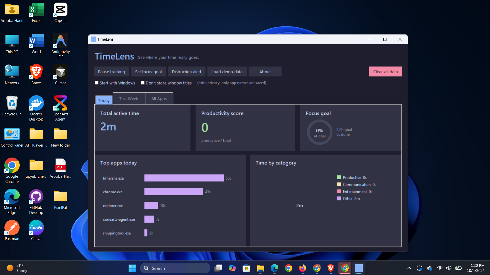
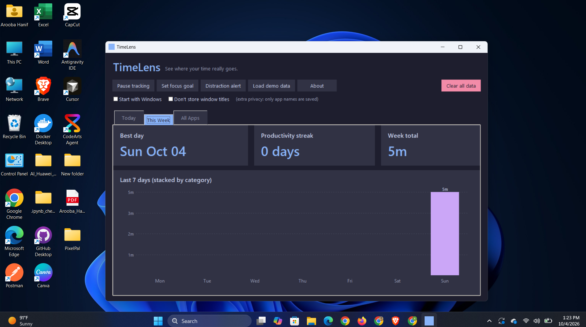
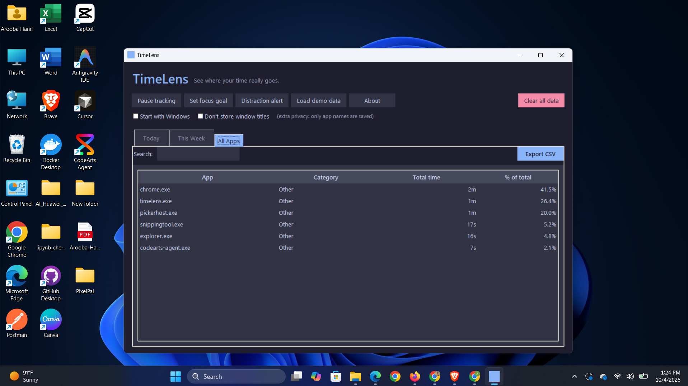

# ⏱️ TimeLens

**See where your time really goes.**
A private, offline screen-time tracker for Windows. It quietly tracks which apps you use, then shows you clear charts, a productivity score, and weekly trends. Your data never leaves your computer.


<p align="center">
  
</p>

---

## ✨ Features

### 📊 Understand your day
- **Automatic tracking**: detects the app you're actually using, every second, in the background.
- **Idle detection**: counting pauses after 2 minutes without keyboard or mouse activity, so time away from the desk doesn't count.
- **Today dashboard**: total active time, top apps bar chart, and a donut chart by category.
- **Productivity score (0-100)**: the share of your active time spent in productive apps.
- **Weekly view**: 7-day stacked chart, your best day, and a streak of days with a good score.
- **All Apps table**: every app you've used, with category, total time, and share of your day. Searchable and exportable to CSV.

### 🎯 Stay on track
- **Daily focus goal**: set a target for productive hours and watch the progress ring fill up. You get a notification when you reach it.
- **Distraction alert**: a gentle reminder if you spend too long in an entertainment app.
- **Smart categories**: apps are sorted into *Productive*, *Communication*, *Entertainment* and *Other*. Don't agree? Right-click any app to change its category, and TimeLens remembers.

### 🔒 Private by design
- **100% local**: everything is stored in a small SQLite database on your computer. No account, no cloud, no internet connection.
- **"Don't store window titles"** option: keep only app names, nothing about what you were reading or typing.
- **Pause anytime** and **clear all data** with one click.

### ⚙️ Convenient
- **Start with Windows**: begin tracking automatically when your PC turns on.
- Keeps running in the background when minimized.
- **Load demo data** button to explore the dashboard instantly.
- Modern dark theme.
- **Zero dependencies**: built with Python's standard library only.

---

## 📸 Screenshots

**Today**: your day at a glance


**This Week**: trends, best day, and streak


**All Apps**: the full breakdown


> The screenshots above use the built-in *demo data*, not real usage.

---

## 📥 Download (easiest)

1. Go to the [**Releases**](../../releases) page.
2. Download `TimeLens.exe` from the latest release.
3. Double-click it. That's it, no installation needed.

> **Windows SmartScreen or antivirus warning?**
> TimeLens reads the name of the window you are using, which is how it tracks time. Because it is also a small unsigned `.exe`, Windows or your antivirus may occasionally flag it by mistake (a *false positive*). Click **More info → Run anyway**. The complete source code is in this repository, so you can check exactly what it does.

---

## 🧭 How to use

1. **Open TimeLens** and keep it running (minimize it, don't close it).
2. Use your computer as usual. Tracking happens automatically.
3. Come back to see **Today**, **This Week** and **All Apps**.
4. Set a **focus goal** to build a daily habit.
5. Not sure what the dashboard looks like? Click **Load demo data**. You can remove it anytime with **Clear all data**.

| Button | What it does |
|---|---|
| **Pause tracking** | Stops and resumes tracking |
| **Set focus goal** | Choose your daily productive-hours target |
| **Distraction alert** | Turn on reminders for long entertainment sessions |
| **Load demo data** | Fills the dashboard with a week of sample data |
| **Clear all data** | Deletes everything (asks for confirmation) |
| **About** | Privacy info and version |

---

## 🛠️ Run from source

Requirements: **Windows** and **Python 3.8+** (`tkinter` comes with the standard Python installer).

```bash
git clone https://github.com/AroobaHanif/TimeLens.git
cd TimeLens
python timelens.py
```

No `pip install` needed.

### Build your own `.exe`

```bash
pip install pyinstaller
pyinstaller --onefile --noconsole --name TimeLens --icon icon.ico --add-data "icon.ico;." timelens.py
```

The executable will appear in the `dist/` folder.

---

## 🧠 How it works

- A background thread checks the foreground window every second using the Windows API (`user32` and `kernel32` through Python's built-in `ctypes`), and records the app's `.exe` name.
- Idle time is detected with `GetLastInputInfo`, so time away from the keyboard isn't counted.
- Time is saved to a local **SQLite** database (`sqlite3`) in `%APPDATA%\TimeLens`, and flushed regularly so nothing is lost if the app closes unexpectedly.
- The charts (bar, donut, stacked weekly bars, and progress ring) are drawn by hand on a `tkinter.Canvas`.
- **Productivity score** = productive time ÷ total active time × 100.

---

## 📁 Project structure

```
TimeLens/
├── timelens.py        # the whole app (TimeLensApp + Tracker)
├── icon.ico           # app icon
├── assets/            # screenshots
├── requirements.txt   # no external dependencies
├── LICENSE            # MIT
└── README.md
```

---

## 🗺️ Ideas for the future

- Monthly reports
- Per-app daily limits
- Website-level tracking for browsers
- Light theme

---

## 📄 License

Released under the [MIT License](LICENSE).

---

Made with ❤️ and Python by [Arooba Hanif](https://github.com/AroobaHanif)

If TimeLens helps you, give it a ⭐ on GitHub!
